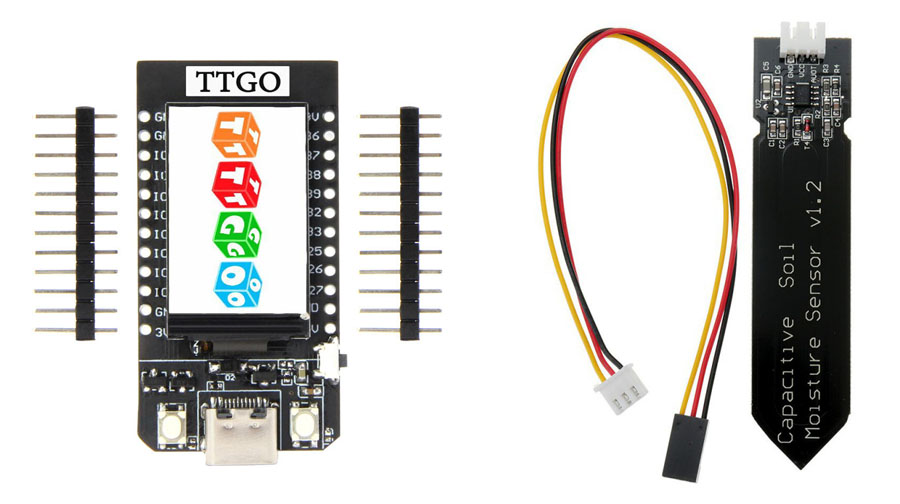
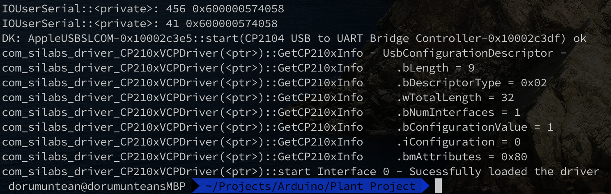
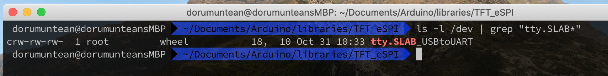

## Prerequisites

### Hardware:
  1. LILYGO TTGO T-Display ESP32 board
  2. USB-C data cable
  3. Soil moisture sensor
  4. 3 small wires
  5. Soldering iron
  6. Optionally a 3d printer to print the case

### Software
  1. Arduino IDE
  2. ESP32 boards support for Arduino IDE
  3. TFT_eSPI Arduino IDE library
  4. Silabs CP210 driver (for MacOS)


## Steps

#### 1. Arduino IDE
  - Install the Arduino IDE software from https://www.arduino.cc/en/software.


#### 2. Add support for ESP32 boards
  - Open Arduino IDE and go to File -> Preferences
  - Enter https://dl.espressif.com/dl/package_esp32_index.json into the “Additional Board Manager URLs”. Then, click the “OK” button
  - Open the Boards Manager. Go to Tools -> Board -> Boards Manager
  - Search for ESP32 and press install button for the “ESP32 by Espressif Systems“
  - Restart Arduino IDE


#### 3. Install the TFT_eSPI Arduino IDE library
  - Open Arduino IDE and go to Sketch -> Include Library -> Manage Libraries
  - Search for "TFT_eSPI" and press install button for the TFT_eSPI by Bodmer"
  - Restart Arduino IDE

##### Setup the TFT_eSPI library for our TTGO board's screen
The TFT_eSPI needs a little modification for our board's screen to work, we will need to comment one line and uncomment another in a file called User_Setup_Select.h that the library contains.
  - After installing the TFT_eSPI Arduino IDE library (in step 3) open the /Users/{YOUR_USERNAME}/Documents/Arduino/libraries/TFT_eSPI/User_Setup_Select.h file
  - Comment this line:

    ```
    #include <User_Setup.h>           // Default setup is root library folder
    ```

  - Uncomment this line:

    ```
    #include <User_Setups/Setup25_TTGO_T_Display.h>    // Setup file for ESP32 and TTGO T-Display ST7789V SPI bus TFT
    ```

  - Save User_Setup_Select.h
  - Restart Arduino IDE (if it was open)


#### 4. Install the Silabs CP210 driver
The TTGO board needs to be connected to a USB to UART port, to have that option in Arduino IDE -> Tools -> Port, we need
to download and install the Silabs MacOS driver from [here](https://www.silabs.com/products/development-tools/software/usb-to-uart-bridge-vcp-drivers).

##### Check if the drivers installed correctly
  - Connect the board to the computer via a USB-C data cable (make sure it's a data cable not only a charging cable)
  - Open a terminal an type
```
sudo -s dmesg
```

We should see an output like this:



 - Also type:
```
ls -l /dev | grep "tty.SLAB*"
```

We should something similar to this (without the date obviously)



- If we see the above 2 outputs then we are ready for the next Step.


#### 5. Setup the TTGO board in Arduino IDE
  - Open Arduino IDE and


#### 6. Write the program to the TTGO board
  - The Arduino sketch can be found in the /sketch repository folder
  - Open it and write it into your TTGO board


## Other TFT_eSPI examples we can use
- Arduino IDE select -> File -> Examples -> TFT_eSPI -> Generic -> alphaBlend_Test
- Arduino IDE select -> File -> Examples -> TFT_eSPI -> 160 x 128 -> TFT_Clock_Digital

## About the Capacitive Soil Moisture Sensor
The sensor should be sealed on the sides, otherwise the readings will not be so good.
Use PlastiDip, epoxy or nail polish (but this is not so good for the job).

## References
 - https://www.youtube.com/watch?v=UE1mtlsxfKM&t=697s
 - https://www.silabs.com/products/development-tools/software/usb-to-uart-bridge-vcp-drivers
